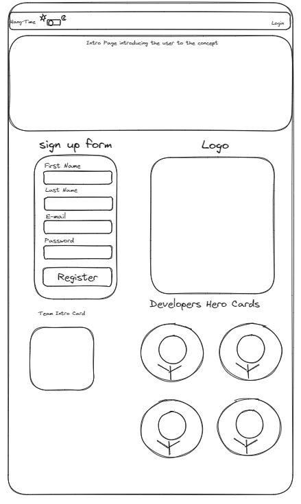
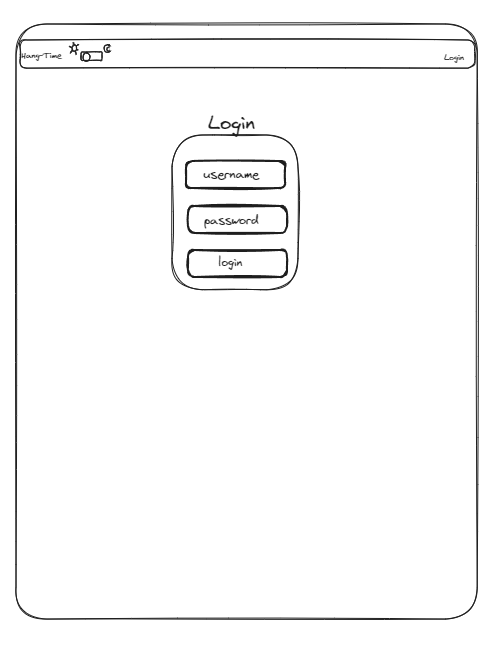
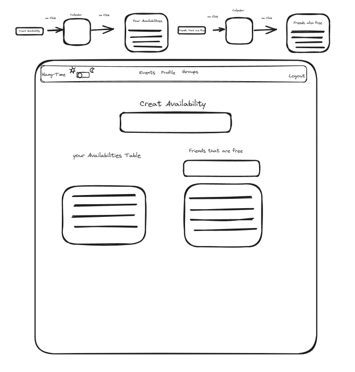
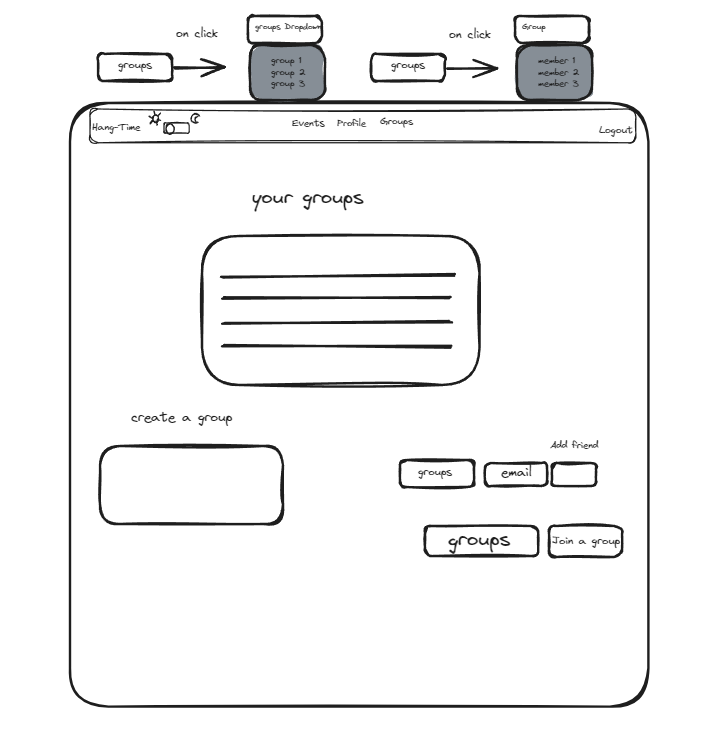
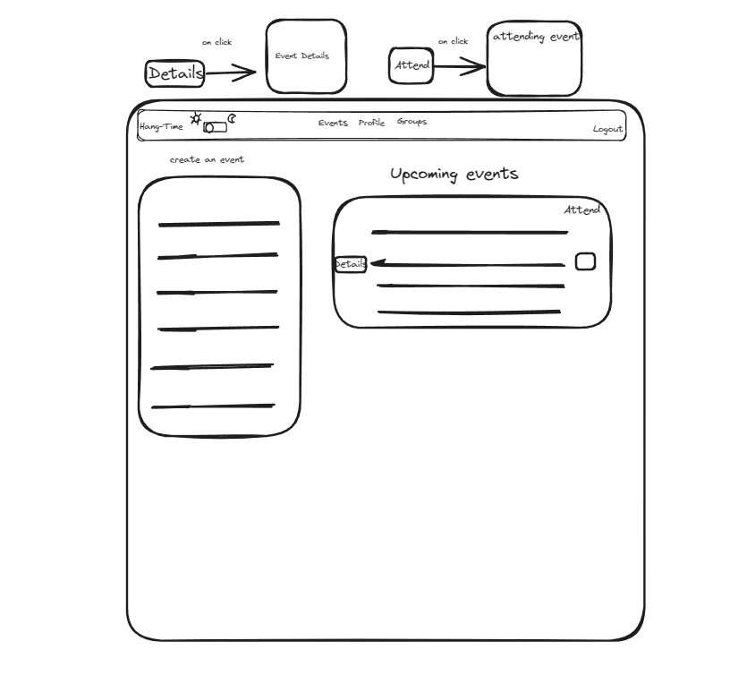
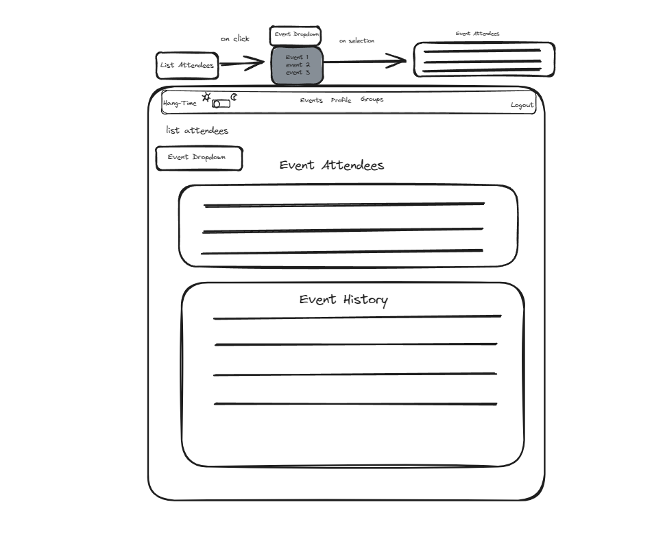

# Customer Graphical Human Interface

## Home Page

This will be the first page visitors arrive at on the website. There will be a link to the navigation bar. The ability to change the page theme to dark mode. There is an intro card introducing the potential user to the site and what it does. The user will be able to sign up to see the logo, a hero card collection of the developers. The link in the navbar renders the login Page.

      

## Profile Page

This page is where users will add the days they are available to hang out. When users select a date from the dropdown, an availability will be created in the Database and will be rendered in the "Your Availabilities" table. In the next component, you will be able to select a date, and a table will render with all your group friends who are also free on that day.

## Group Page

In the Groups Section of the groups page, the user will be able to create a group, join a group, add a friend to a group by email, and see a table containing the events associated with the groups the user belongs to. In the Events section of the page, the user will be able to Create Social events. There will be a dropdown in the groups section of the form that scrolls through the user's groups. The upcoming events will also render if the user has upcoming events for the groups they are in. You can press the detail button to see the event details page, and the other checkbox is to mark the user down as attending said event.

## Events Page

The Events Page will have a list attendees dropdown with an active list of events from the groups the user is in. Once an event is selected, a table will render with the other event attendees. The next element is the event history page, which will render the event history for the user's groups. Anything older than the current day will render in said list.

